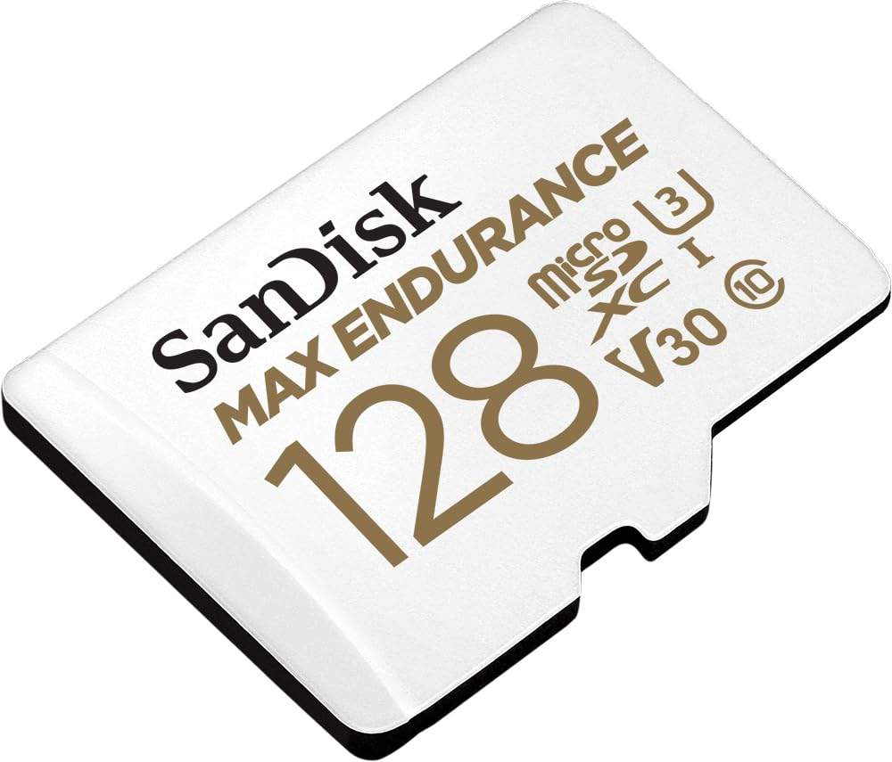
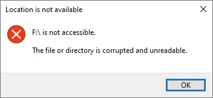
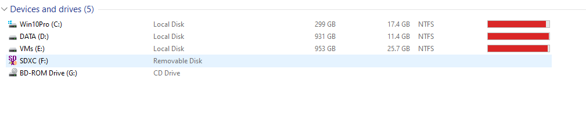

# SanDisk 128GB MAX Endurance microSDHC
Purchased on 10-Apr-2024 

### SanDisk 128GB MAX Endurance microSDHC™ Card with Adapter for 4K Video on Dashcams and Video Surveillance Cameras



Amazon Link: 
https://www.amazon.in/dp/B084CJ9T2R


## Unable to Read Issue (March 2025)
I am using SanDisk SD Card in my 70mai Dashcam for car.  Recently when I took out the SD Card Reader and connected to Windows 10 laptop, it worked well for sometime.  Suddenly Windows Explorer started giving error messages while reading the SD Card.  

I ejected SD Card and inserted it again on my Windows Laptop using the SD Card Reader.  The SD Card is getting detected and shows as a Drive Letter.  But when I try to open this Drive, I am getting this error:



```
Location is not available

F:\ is not accessible.

The file or directory is corrupted and unreadable.
```

In Windows Explorer, it detects the SD Card as F Drive, but does not show details in other columns (Total Space, Free Space, File System):



### Troubleshooting Step 1 - CHKDSK
I ran CHKDSK from Command Prompt (Administrator mode):

```
chkdsk F: /f /r /x
```

Sample output of `chkdsk` command is given  below. For the full output of chkdsk command, check this  [chkdsk-run-01.txt](./log/chkdsk-run-01.txt) file.

```
C:\Windows\system32>chkdsk f: /f /r /x
The type of the file system is FAT32.
Volume Serial Number is XXXX-XXXX
The specified disk appears to be a non-Windows XP disk.
Updating FAT media type.
The \ entry contains a nonvalid link.
Windows is verifying files and folders...
\USBC╨☻  Invalid time stamp.
The size of the \USBC╨☻ entry is not valid.
Removing trailing folder entries from \
File and folder verification is complete.
Bad links in lost chain at cluster 3 corrected.
Bad links in lost chain at cluster 4 corrected.
Bad links in lost chain at cluster 5 corrected.
Lost chain cross-linked at cluster 13311.  Orphan truncated.
Bad links in lost chain at cluster 46 corrected.
Bad links in lost chain at cluster 47 corrected.
Lost chain cross-linked at cluster 48.  Orphan truncated.
Lost chain cross-linked at cluster 49.  Orphan truncated.
Bad links in lost chain at cluster 50 corrected.
Bad links in lost chain at cluster 1900549 corrected.
Bad links in lost chain at cluster 1900551 corrected.
Convert lost chains to files (Y/N)? Y
44194176 KB in 1689 recovered files.
Windows is verifying free space...
Free space verification is complete.

Windows has made corrections to the file system.
No further action is required.
  124,835,840 KB total disk space.
           64 KB in 1 folders.
   44,194,176 KB in 1,690 files.
   80,641,536 KB are available.

       65,536 bytes in each allocation unit.
    1,950,560 total allocation units on disk.
    1,260,024 allocation units available on disk.

C:\Windows\system32>
```
