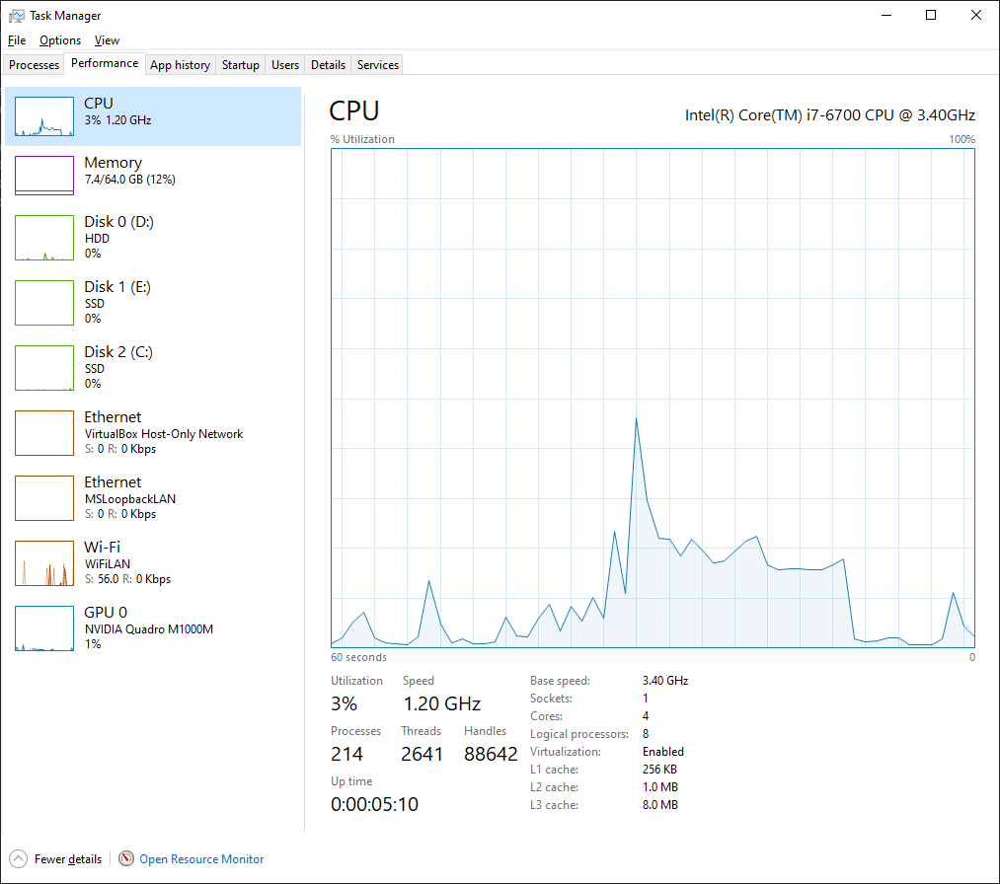
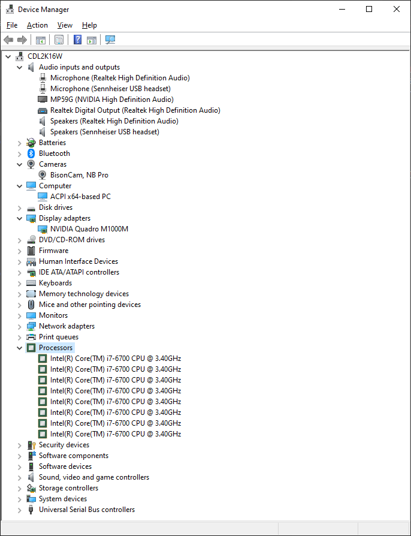

# Azom Laptop 

```
Barebone: Clevo P775DM
Processor: Intel(R) Core(TM) i7-6700 CPU 3.40 GHz
RAM: 64.0 GB (GSkill DDR4 2133 Mhz)
GPU: NVIDIA Quadro M1000M 2GB GDDR5
Storage:
- SSD1: 512 GB (Samsung NVMe M2.2280)
- SSD2: 1 TB (Liteon NVMe M2.2280)
- HDD: 1 TB (Hgst 7200 RPM)
```



