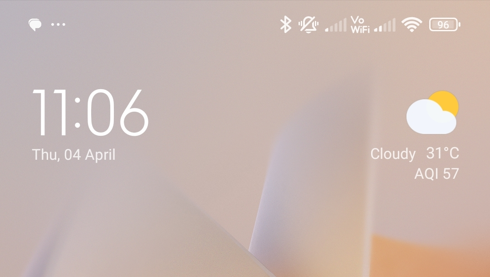

# Redmi Note 12 5G - VoWiFi Issue with Airtel SIM

## My Setup Details 
```
SIM 1 - Airtel 
SIM 2 - Jio 

Location: Bangalore - Home (Apartment)

Wired Broadband Connections 
1) ACT Fibernet
2) Hathway
```
## Issue Details
1. Since the time I got RN12-5G Phone, the VoWiFi Feature of Airtel is not working.
1. I am using Airtel in SIM1 and Jio in SIM2.
1. The Jio SIM2 is showing VoWiFi all the time.
1. The Airtel SIM1 does not shows VoWiFi **most of the time**.  Rarely (random time) the Airtel SIM1 shows VoWiFi for few seconds and it again disappears.
1. I have two Wired Broadband Connections (ACT Fibernet and Hathway) at Home and I have verified the same result on both. 

## My Troubleshooting (on RN12-5G)
1. I tried to swap SIM1 and SIM2. But got the same VoWiFi issue with  Airtel.
1. I got the Airtel SIM changed.  But got the same VoWiFi issue with Airtel 

## My Observation
1. Before RN12-5G, I had Redmi Note 7 Pro (RN7Pro) phone. On my RN7Pro, VoWiFi was working perfectly alright on both Airtel and Jio SIM.
1. My Wife is using `Samsung Galaxy M21 2021 Edition` and VoWiFi is working fine on her Airtel SIM.
1. My Son is using `Vivo Y33s` and VoWiFi is working fine on his Airtel SIM.


## Screenshots 

### SIM 1 - Jio, SIM 2 - Airtel (04-Apr-2024)


### SIM 1 - Airtel, SIM 2 - Jio (02-Oct-2023)

